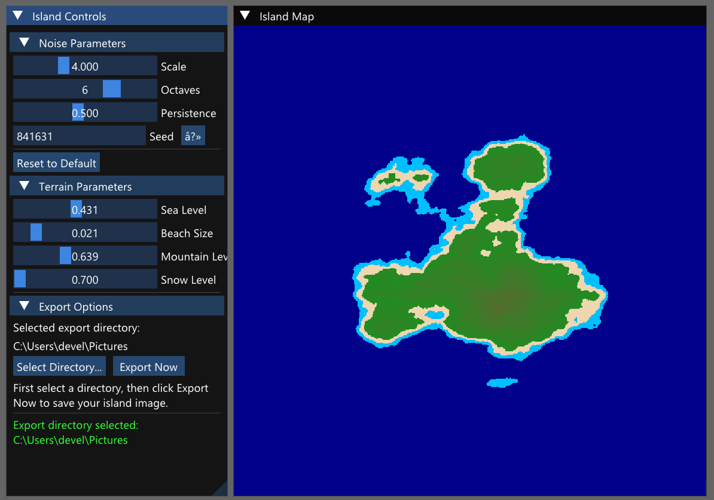

# Procedural Island Generator

A C++ application that generates beautiful procedural islands using Perlin noise and SFML graphics. Features include real-time parameter adjustment, multiple biomes, and PNG export capabilities.



## Features

- Real-time island generation using Perlin noise
- Interactive parameter adjustment:
  - Noise scale, octaves, and persistence
  - Sea level and beach size
  - Mountain and snow levels
- Multiple biome visualization:
  - Deep and shallow water
  - Beaches
  - Grasslands and forests
  - Mountains and snow peaks
- PNG export functionality
- Modern ImGui-based user interface
- Multi-island archipelago generation

## Prerequisites

- Windows 10 or later
- Visual Studio 2022 (or compatible C++ compiler)
- CMake 3.15 or higher
- SFML 2.5.1 or higher
- NSIS (for creating the installer)

## Building from Source

1. **Clone the repository:**
   ```bash
   git clone https://github.com/yourusername/procedural-island-generator.git
   cd procedural-island-generator
   ```

2. **Configure with CMake:**
   ```bash
   mkdir build
   cd build
   cmake .. -G "Visual Studio 17 2022" -A x64
   ```

3. **Build the project:**
   ```bash
   cmake --build . --config Release
   ```

4. **Create the installer (optional):**
   ```bash
   cpack -C Release
   ```

## Installation

### Option 1: Using the Installer

1. Download the latest release installer (`ProceduralIslandGenerator-1.0.0-win64.exe`)
2. Run the installer and follow the prompts
3. Launch the application from the Start Menu or desktop shortcut

### Option 2: Manual Installation

1. Build from source following the steps above
2. Copy the executable and required DLLs to your desired location
3. Run `ProceduralIslandGenerator.exe`

## Usage

1. **Launch the application**
   - The main window shows the generated island
   - Control panel on the left contains all parameters

2. **Adjust Generation Parameters:**
   - **Noise Parameters:**
     - Scale: Controls the overall size of features (1.0 - 10.0)
     - Octaves: Affects detail level (1 - 8)
     - Persistence: Controls feature prominence (0.1 - 1.0)
     - Seed: Changes the random pattern (or click ↻ for random seed)

   - **Terrain Parameters:**
     - Sea Level: Adjusts water coverage (0.0 - 1.0)
     - Beach Size: Controls beach width (0.01 - 0.1)
     - Mountain Level: Sets mountain height (0.5 - 0.9)
     - Snow Level: Adjusts snow coverage (0.7 - 1.0)

3. **Export Your Island:**
   - Click "Select Directory..." to choose save location
   - Click "Export Now" to save as PNG
   - Files are named with seed and timestamp for reference

## Building the Installer

To create a distributable installer:

1. Install NSIS from https://nsis.sourceforge.io/Download
2. Add NSIS to your system PATH
3. Follow the build steps above
4. Run `cpack -C Release` in the build directory
5. Find the installer in the build directory

## Development

### Project Structure

```
IslandGenerator/
├── include/
│   ├── NoiseGenerator.hpp
│   ├── IslandGenerator.hpp
│   └── TextureManager.hpp
├── src/
│   ├── main.cpp
│   ├── NoiseGenerator.cpp
│   ├── IslandGenerator.cpp
│   └── TextureManager.cpp
├── tools/
│   ├── icon_generator.cpp
│   └── CMakeLists.txt
├── resources/
│   └── icon.ico
├── CMakeLists.txt
└── README.md
```

## License

This project is licensed under the MIT License - see the LICENSE file for details.

## Contributing

1. Fork the repository
2. Create your feature branch (`git checkout -b feature/AmazingFeature`)
3. Commit your changes (`git commit -m 'Add some AmazingFeature'`)
4. Push to the branch (`git push origin feature/AmazingFeature`)
5. Open a Pull Request

## Acknowledgments

- SFML team for the graphics library
- Dear ImGui for the user interface
- Perlin noise implementation based on [reference] 